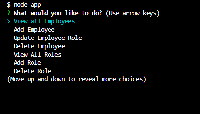
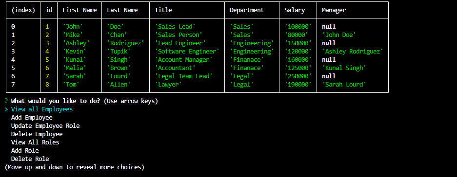
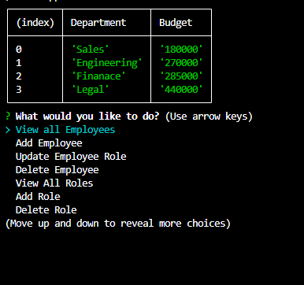

# Employee Tracker

## Video Link
[Video](https://drive.google.com/file/d/1qPJJv4dr2cd1NC5ub-X1v-PUr9lIcMoh/view)

## Description
    - As a developer I wanted to be able to track a companies departments, employees and roles, and be able to update/add/delete anything
    - This project was built to allow a business owner to manage their companies departments, employees and subsequent roles, including salaries and managers.
    - This project was able to solve how to use SQL in conjunction with javascript and inquirer, to create a CLI app that allows the user to move through and manipulate multible tables within the companies database.  
    - This project allowed me to learn how to create and seed a sql database. I also become more familiar with inquirer to get user input and then using .query functionality to get relevant database data from one or more tables and out put a table with the user requested/ or changed data. I leanred about another important use of git.ignore, which was to have it ignore a small file with private username and password information used to access mySQL, that otherwise would have been out in the open.
    

## Installation
    To install this follow the link to the github repository below.
[Eomployee Tracker](https://github.com/Neglon/Employee-Tracker)
Clone the files to you pc. Using VSCode, open the terminal, in gitbash, navigate to the folder holding all the cloned files and run `npm i inquirer@8.2.4`, and then run `npm i mysql2`
Once those have been installed navigate into the db folder. enter `mysql -u "your username" - p` Then enter your password to enter mysql. Run `source chema.sql;` to set up the database. Now run `source seeds.sql;` to seed the database. Enter `quit` into the mysql prompt to kill the connection. 
Next navigate back to the main folder holding all the files and create a file called "connection.js" and place this following code into it.
```
const mysql = require('mysql2');
const connection = mysql.createConnection({
  host: 'localhost',
  user: 'your_username',
  password: 'your_password',
  database: 'employee_tracker'
});

connection.connect(err => {
  if (err) throw err;
});

module.exports = connection;
```
Enter your username and password into the place holders. This file is included in the gitignore for privacy.

Finally in the terminal to run `node app.js` to start the app.


## Usage
    Once the app is started you will have a list of options to scroll through in the cli, pick the option you want to explore. If it is a standard view choice, a table with the requested data will appear. If it is an add/update/delete option, the user will be asked for additional inputs to manipulate the database. Once completed the user will be able to navigate to the relevant view choice to see the change that has been made, and will be returned to the main menu after each choice is completed.


   




## Credits
    N/A

## Liscence
    N/A

## Code Source
    Code fully written by Thomas Neylon, references were made to previous classwork, and the websites below.
    
[Console.table](https://www.syncfusion.com/blogs/post/11-console-methods-in-javascript-for-effective-debugging.aspx)
   
[Concat SQL](https://stackoverflow.com/questions/3251600/how-do-i-get-first-name-and-last-name-as-whole-name-in-a-mysql-query)

[Combine multiple cols from multiple tables](https://stackoverflow.com/questions/8303275/select-multiple-columns-from-multiple-tables)

[Choices Inquirer](https://stackoverflow.com/questions/46210279/pass-objects-in-array-into-inquirer-list-choices)

[Unshift Array](https://www.w3schools.com/jsref/jsref_unshift.asp)

